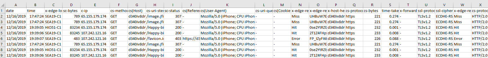

# CloudFront
CloudFront Notes and Functions

# Process-AWSCloudFrontLogs.ps1
CloudFront stores log files in .gz format. This script expects extracted files with a .txt extention. 

Use [ConvertFrom-Gzip.ps1](https://gallery.technet.microsoft.com/scriptcenter/ConvertFrom-GZip-edcbf6a9) to prepare the log files.

```
. ConvertFrom-Gzip.ps1
$LogFiles = Get-ChildItem .\ -Filter *.gz | Select-Object -ExpandProperty Name
ForEach ($LogFile in $LogFiles) {
  $LogFile | ConvertFrom-Gzip | Out-File .\$LogFile.txt
}
```

The 'cs(User-Agent)' field is URL encoded twice for some reason, so we must [decode it twice](https://github.com/tylerapplebaum/CloudFront/blob/cb31839247acac7eea2a47c966dc426110d0dfc2/Process-AWSCloudFrontLogs.ps1#L24).

The result -

